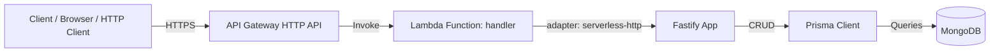
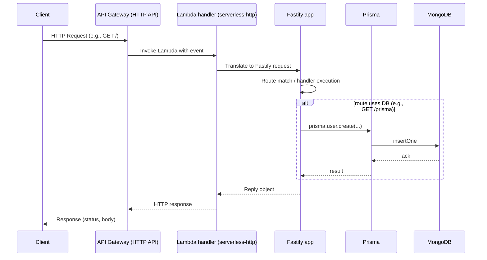

# Project Architecture Blueprint

Generated: 2025-08-09

Configuration (auto-detected)
- PROJECT_TYPE: Node.js (TypeScript)
- ARCHITECTURE_PATTERN: Serverless (AWS Lambda + API Gateway HTTP API)
- DIAGRAM_TYPE: Component (with sequence/data flow via Mermaid)
- DETAIL_LEVEL: Comprehensive
- INCLUDES_CODE_EXAMPLES: true
- INCLUDES_IMPLEMENTATION_PATTERNS: true
- INCLUDES_DECISION_RECORDS: true
- FOCUS_ON_EXTENSIBILITY: true

Repository context
- Key tech: Fastify 5, TypeScript 5, Serverless Framework 3, serverless-esbuild, serverless-offline, serverless-http, Prisma 6 (MongoDB), Jest + SWC, ESLint + Prettier, Husky, Lint-Staged, Commitlint, Semantic Release
- Entrypoints: `src/app.ts`, `src/handler.ts`
- Infra/config: `serverless.yml`
- Data: `prisma/schema.prisma`
- Scripts: `scripts/database.ts`, `scripts/prisma.ts`, `scripts/deployDbProd.ts`

## 1. Architecture detection and analysis

Technology stacks and frameworks
- Node.js runtime on AWS Lambda (nodejs20.x)
- Fastify web framework with `@fastify/helmet` for security headers
- Serverless Framework for packaging/deployment, `serverless-esbuild` for bundling
- API Gateway HTTP API (CORS enabled) as the inbound edge
- Prisma Client for data access; MongoDB as datasource (local in-memory for dev, external for prod)
- TypeScript strict configuration with path alias `@/*`
- Jest + Supertest for tests (SWC transform)

Architectural pattern(s)
- Serverless monolith: a single Lambda function (`functions.app`) behind HTTP API handling all routes via Fastify
- Layered concerns within the function: transport (API Gateway) -> adapter (`serverless-http`) -> application (Fastify routes/handlers) -> data (Prisma -> MongoDB)
- Clear dependency direction: routes depend on Prisma client; no inverse dependency from data to application

Boundaries and enforcement
- API boundary: API Gateway HTTP API invoking the Lambda handler exported from `src/handler.ts`
- Application boundary: Fastify application in `src/app.ts`
- Data boundary: Prisma client initialization in `src/app.ts` and schema in `prisma/schema.prisma`
- Build/deploy boundary: Serverless Framework (`serverless.yml`) controls packaging, env resolution, and runtime

## 2. Architectural overview

Guiding principles
- Minimal but production-ready serverless setup with simple routing
- Type-safe development via strict TypeScript config
- Fast local feedback loops: Serverless Offline, esbuild bundling, SWC for tests
- Infrastructure as configuration in `serverless.yml`

Architectural boundaries
- Inbound HTTP requests are handled by Fastify routes within a single Lambda; no cross-function calls
- Data access via Prisma repository abstraction; domain model is minimal (`User`)
- Environment-specific wiring (Offline vs Prod) via Serverless variables and dotenv plugin

Hybrid/adaptations
- `serverless-http` is used to adapt Fastify to the AWS Lambda handler interface (designed primarily for Express types; cast to `any` in TS)
- MongoDB in-memory replica set for local development, managed via a dev script, with Prisma DB Push to provision schema

## 3. Architecture visualization

High-level component overview



Sequence (request lifecycle)



Data flow

```mermaid
flowchart TB
  Req[HTTP Request]
  Rt[Fastify Route Handler]
  Val[Input Validation (planned)]
  Svc[Business Logic (in-route)]
  Repo[Prisma Client]
  DB[(MongoDB)]
  Res[HTTP Response]

  Req --> Rt --> Val --> Svc --> Repo --> DB
  DB --> Repo --> Res
```

Note: Input validation via Fastify schemas is not yet implemented; see recommendations in Validation section.

## 4. Core architectural components

Application API (Fastify app)
- Purpose: Define HTTP routes, register plugins (helmet), and set error/not-found handlers
- Responsibility: HTTP transport and request handling
- Internal structure: `src/app.ts` constructs `fastify()` instance; registers routes `/` and `/prisma`; `setNotFoundHandler`
- Interaction: Invoked via `serverless-http` adapter; communicates with Prisma for persistence
- Evolution: Add routes via `app.get/post/...`; register Fastify plugins for validation, auth, logging

Lambda handler adapter
- Purpose: Bridge AWS Lambda event/context to Fastify
- Implementation: `serverless-http(app as any)` exported as `handler` in `src/handler.ts`
- Interaction: Receives API Gateway events; delegates to Fastify app
- Evolution: Keep adapter thin; prefer adding cross-cutting behavior via Fastify hooks or middleware

Data access (Prisma + MongoDB)
- Purpose: CRUD access to MongoDB collections via Prisma models
- Structure: Prisma schema in `prisma/schema.prisma` with `User` model; client generated on postinstall
- Interaction: `new PrismaClient()` in `src/app.ts`
- Evolution: Add models and relations in schema; run `prisma generate`/`db push`

Build/deploy (Serverless Framework)
- Purpose: Configure runtime, packaging, and events
- Structure: `serverless.yml` defines provider, function `app`, plugins, packaging patterns, offline config
- Interaction: `yarn deploy-prod`, `yarn dev` (offline) orchestrate lifecycle
- Evolution: Add more functions, resources, layers as needed

## 5. Architectural layers and dependencies

Layers
- Transport: API Gateway HTTP API
- Adapter: serverless-http -> Fastify
- Application: Fastify routes and handlers
- Data: Prisma client -> MongoDB

Dependency rules
- Application depends on Data; Data is independent (schema-driven)
- Adapter depends on Application; Transport depends on Adapter

Abstractions
- Prisma client abstracts MongoDB driver
- Fastify abstracts HTTP server details

Issues
- No circular dependencies detected
- Prisma client created at module scope; for Lambda cold starts this is fine, but consider re-use across invocations to reduce connection churn

## 6. Data architecture

Domain model
- `User`: `id` (ObjectId), `email` (unique)

Relationships
- No relations defined (single collection)

Data access pattern
- Direct use of Prisma client in route handler (`/prisma`)
- No repository abstraction layer beyond Prisma; acceptable at current size

Transformations
- None beyond Prisma model mapping

Caching
- None implemented

Validation
- Relying on MongoDB unique index via Prisma `@unique` on `email`

## 7. Cross-cutting concerns implementation

Authentication & Authorization
- Not implemented. All routes are public.
- Recommendation: Use Fastify plugins such as `@fastify/jwt` or delegating to API Gateway authorizers (JWT/Cognito) and check claims in Fastify

Error handling & resilience
- Not-found handler returns `{ error: 'NOT FOUND' }` with 404
- Route-level errors default to Fastify’s error handling
- Recommendation: Add a global error handler to standardize error responses and map known error types
- Consider retries/backoff in data layer where appropriate (Prisma handles driver-level errors)

Logging & monitoring
- Fastify logger is not enabled (default false when `fastify()` called without `logger: true`)
- Use `sls logs -f app -t` to tail Lambda logs via script `tail-log`
- Recommendation: Enable Fastify logger in prod, structure logs as JSON, and integrate with CloudWatch metrics/embedded metrics

Validation
- Currently no JSON schema validation on routes
- Recommendation: Define `schema` for each route (params, querystring, body, response) to leverage Fastify’s AJV

Configuration management
- `serverless-dotenv-plugin` loads env vars by stage
- `DATABASE_URL` used by Prisma; `.env.production` is used for `deploy:db`
- Serverless variables for `stage` and `region` control deployment context
- Secret management: Env vars; consider AWS SSM Parameter Store or Secrets Manager for production

## 8. Service communication patterns

- Boundary: Single service (one Lambda) exposing HTTP endpoints
- Protocol/format: HTTPS + JSON
- Sync vs async: Synchronous only
- Versioning: Not implemented; could introduce base path versioning (e.g., `/v1`) in Fastify routes
- Discovery: N/A (single service)
- Resilience: Relies on API Gateway/Lambda retry semantics for invocations; app-level idempotency not implemented

## 9. Technology-specific architectural patterns

Node.js / Fastify patterns
- Plugin registration for cross-cutting concerns (`@fastify/helmet`)
- Route handlers are async and return JSON
- Not-found handler for uniform 404
- Suggestion: Use Fastify decorators for shared utilities (e.g., injecting Prisma instance) and organize routes by feature

Serverless patterns
- Single function mapped to catch-all `{proxy+}` method `*` for HTTP API
- Packaging includes Prisma engine binaries adjusted per stage (`custom.prismaEngine`)
- Offline development with hot-reload via `serverless-offline`

Prisma patterns
- `postinstall` runs `prisma generate`
- `db push` used for schema synchronization (MongoDB)
- Dev script uses mongodb-memory-server replica set for majority writes

## 10. Implementation patterns

Interface design patterns
- Keep route handlers thin; extract domain logic into services when complexity grows
- Use TypeScript interfaces for request/response DTOs when adding validation

Service implementation patterns
- Register services via Fastify decorators to allow DI-like access (`fastify.decorate`)
- Manage lifetimes: services constructed on app boot; Prisma client reused across requests within a Lambda execution context

Repository implementation patterns
- Direct use of Prisma client; for complex domains, wrap Prisma calls in repository classes to encapsulate queries and transaction semantics

Controller/API implementation patterns
- Define routes with Fastify; attach JSON schema for validation and typed responses
- Standardize response envelopes and error formats

Domain model implementation
- Extend Prisma schema with additional models; use value object patterns in TypeScript where appropriate (validated constructors)

## 11. Testing architecture

Strategies
- Unit tests for pure functions/services (to be added as the domain grows)
- Integration tests for HTTP using Supertest (current `src/app.test.ts` covers `GET /` and 404)

Boundaries
- App-level tests target Fastify server instance without invoking Lambda adapter
- Data-dependent tests can run against in-memory Mongo via `mongodb-memory-server` or mocked Prisma

Test doubles & data
- Use factory functions or fixtures for request payloads
- For Prisma, consider `@quramy/jest-prisma` or manual sandbox DB

Tools
- Jest with `@swc/jest` transformer; coverage thresholds configured at 30%

## 12. Deployment architecture

Topology
- API Gateway (HTTP API) -> AWS Lambda (Node.js 20) -> VPC/non-VPC MongoDB (external)

Environment adaptations
- `serverless.yml` uses stage-based variables and packaging patterns for Prisma engine
- Offline stage runs on port 4000 with hot reload

Runtime dependency resolution
- `serverless-esbuild` bundles code; Prisma engine binaries included via `package.patterns`
- `serverless-dotenv-plugin` loads environment variables per stage

Containerization/orchestration
- Not applicable; Lambda-managed runtime

Cloud service integrations
- CloudWatch for logs; API Gateway metrics optional

## 13. Extension and evolution patterns

Feature addition
- Create route module (e.g., `src/routes/users.ts`) and register in `app.ts`
- Define JSON schema for validation and typed responses
- Interact with Prisma via repositories/services

Modification
- When changing data models, update `prisma/schema.prisma` and run `prisma db push`
- Maintain backward-compatible APIs; deprecate and version routes as needed

Integration
- For external services, implement adapter modules and call from services; consider retries and timeouts
- Use anti-corruption layers when integrating with legacy payloads

### 14. Architectural pattern examples

Layer separation: adapter vs app
```ts
// src/handler.ts
import serverlessHttp from 'serverless-http';
import { app } from './app';
export const handler = serverlessHttp(app as any);
```

Route with Prisma usage
```ts
// src/app.ts
app.get('/prisma', async () => {
  await prisma.user.create({ data: { email: 'random@example.com' } });
  return { msg: 'Add a new unique user without duplicate' };
});
```

Serverless function and catch-all routing
```yaml
# serverless.yml (excerpt)
functions:
  app:
    handler: src/handler.handler
    events:
      - httpApi:
          path: "/{proxy+}"
          method: "*"
```

### 15. Architectural decision records (lightweight)

ADR-001: Serverless + Fastify
- Context: Need quick, cost-effective HTTP API with low ops overhead
- Decision: Use AWS Lambda + API Gateway HTTP API with Fastify for performance and DX
- Consequences: Cold starts acceptable for scale; single-function monolith initially

ADR-002: Prisma + MongoDB
- Context: Flexible schema with quick prototyping; strong TypeScript support
- Decision: Use Prisma with MongoDB provider
- Consequences: Limited Prisma features vs SQL; straightforward local dev with in-memory server

ADR-003: Single catch-all function
- Context: Simplicity for small API surface
- Decision: One Lambda handling all routes via `{proxy+}`
- Consequences: Simpler deploys; may require splitting as domain grows

ADR-004: esbuild + SWC for speed
- Context: Fast feedback loops for dev and CI
- Decision: Bundle with `serverless-esbuild`; transform tests with `@swc/jest`
- Consequences: Fast builds; watch-mode productivity

## 16. Architecture governance

- Consistency through TypeScript strictness and ESLint rules (Airbnb + plugins)
- Automated checks: `yarn check-types`, `yarn lint`, Jest coverage thresholds
- Review practices: PRs with CI (recommended), semantic commits enforced by Commitlint/Commitizen
- Documentation: Keep this blueprint updated when adding routes/models/functions

## 17. Blueprint for new development

Development workflow
- Add/modify Prisma models in `prisma/schema.prisma`; run `yarn prisma db push`
- Create feature route module under `src/` and register in `app.ts`
- Add JSON schemas for validation; write integration tests under `src/*.test.ts`
- Run locally: `yarn dev` (offline) and iterate

Implementation templates
- Routes: `app.get('/path', { schema }, handler)`
- Services: Export pure functions for business logic; inject Prisma via Fastify decorators
- Repositories: Wrap Prisma queries for reuse and centralization

Common pitfalls
- Forgetting to include Prisma engine binaries for target stage; use `package.patterns` as configured
- Creating new PrismaClient per request; reuse a single instance where possible
- Missing validation; add Fastify schemas to prevent runtime errors

Keeping this document fresh
- Regenerate sections when adding new functions/services or models
- Update diagrams to reflect new routes or components
